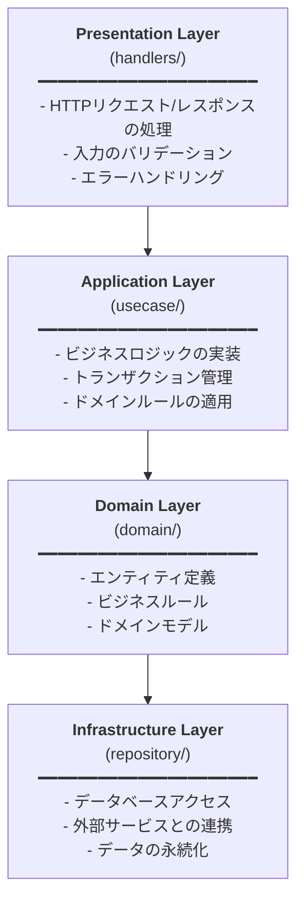

# Backend Architecture

このバックエンドは、**クリーンアーキテクチャ**の原則に従って設計されています。

## アーキテクチャ概要



## レイヤー詳細

### 1. Presentation Layer (`handlers/`)

HTTPリクエストを受け取り、適切なUseCaseを呼び出し、レスポンスを返す層です。

**責務:**
- HTTPリクエストのパース
- UseCaseへの処理委譲
- HTTPレスポンスの構築
- HTTPステータスコードの管理

**主なファイル:**
- `store_handler.go` - ストア関連のエンドポイント
- `menu_handler.go` - メニュー関連のエンドポイント
- `review_handler.go` - レビュー関連のエンドポイント

### 2. Application Layer (`usecase/`)

アプリケーションのビジネスロジックを実装する層です。

**責務:**
- ビジネスロジックの実装
- トランザクション管理
- 複数のRepositoryの調整
- ドメインルールの適用

**主なファイル:**
- `store_usecase.go` - ストア関連のビジネスロジック
- `menu_usecase.go` - メニュー関連のビジネスロジック
- `review_usecase.go` - レビュー関連のビジネスロジック
- `errors.go` - アプリケーション層のエラー定義

### 3. Domain Layer (`domain/`)

ビジネスドメインのモデルを定義する層です。

**責務:**
- エンティティの定義
- ビジネスルールの表現
- ドメインロジック

**主なファイル:**
- `store.go` - Store, Menu, Reviewエンティティの定義

### 4. Infrastructure Layer (`repository/`)

データの永続化や外部サービスとの連携を行う層です。

**責務:**
- データベースアクセス
- クエリの実行
- データの永続化

**主なファイル:**
- `store_repository.go` - ストアのデータアクセス
- `menu_repository.go` - メニューのデータアクセス
- `review_repository.go` - レビューのデータアクセス

## 依存関係の方向

```
handlers (Presentation)
    ↓ 依存
usecase (Application)
    ↓ 依存
domain (Domain) ← repository (Infrastructure)
```

**重要:** 依存性の逆転原則により、UseCaseはRepositoryのインターフェースに依存し、具体的な実装には依存しません。

## データフロー

### リクエストの流れ (例: ストア作成)

1. **Handler** がHTTPリクエストを受信
2. **Handler** がリクエストボディをパース
3. **Handler** が適切な **UseCase** のメソッドを呼び出し
4. **UseCase** がビジネスロジックを実行（バリデーション等）
5. **UseCase** が **Repository** を通じてデータを保存
6. **Repository** がデータベースにクエリを実行
7. **Repository** が結果を返す
8. **UseCase** が結果を **Handler** に返す
9. **Handler** がHTTPレスポンスを構築して返す

## 依存性注入

`cmd/server/main.go`で各層のインスタンスを生成し、依存性を注入します:

```go
// Repository層の初期化
storeRepo := repository.NewStoreRepository(db)

// UseCase層の初期化（Repositoryを注入）
storeUseCase := usecase.NewStoreUseCase(storeRepo)

// Handler層の初期化（UseCaseを注入）
storeHandler := handlers.NewStoreHandler(storeUseCase)
```

## テスタビリティ

各層がインターフェースを通じて依存しているため、以下が容易になります:

- **単体テスト**: 各層を独立してテスト可能
- **モック作成**: インターフェースをモック化して依存を切り離せる
- **統合テスト**: 実際のデータベースを使用したテストも可能

## メリット

1. **関心の分離**: 各層が明確な責務を持つ
2. **テスタビリティ**: 各層を独立してテスト可能
3. **保守性**: 変更の影響範囲が限定的
4. **拡張性**: 新機能の追加が容易
5. **依存性の管理**: 依存の方向が明確
6. **ビジネスロジックの独立性**: フレームワークやライブラリから独立

## ディレクトリ構造

```
apps/backend/
├── cmd/
│   └── server/
│       └── main.go              # エントリーポイント、依存性注入
├── internal/
│   ├── config/                  # 設定管理
│   ├── domain/                  # ドメインモデル
│   │   └── store.go
│   ├── repository/              # データアクセス層
│   │   ├── store_repository.go
│   │   ├── menu_repository.go
│   │   └── review_repository.go
│   ├── usecase/                 # ビジネスロジック層
│   │   ├── store_usecase.go
│   │   ├── menu_usecase.go
│   │   ├── review_usecase.go
│   │   └── errors.go
│   └── handlers/                # プレゼンテーション層
│       ├── store_handler.go
│       ├── menu_handler.go
│       └── review_handler.go
└── migrations/                  # データベースマイグレーション
```

## 今後の拡張

### 新しい機能を追加する場合

1. **Domain**: エンティティを定義または拡張
2. **Repository**: データアクセスインターフェースと実装を追加
3. **UseCase**: ビジネスロジックを実装
4. **Handler**: HTTPエンドポイントを追加
5. **main.go**: 依存性注入を設定

### テストの追加

各層ごとにテストを追加できます:

```
internal/
├── repository/
│   ├── store_repository.go
│   └── store_repository_test.go    # リポジトリのテスト
├── usecase/
│   ├── store_usecase.go
│   └── store_usecase_test.go       # ユースケースのテスト
└── handlers/
    ├── store_handler.go
    └── store_handler_test.go       # ハンドラーのテスト
```
