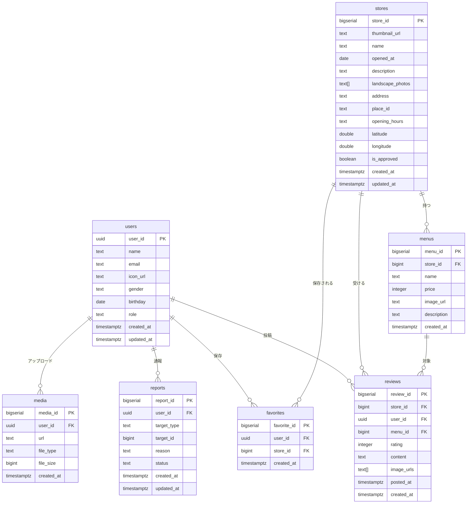

# DB 設計

## ドキュメント情報

- オーナー: Team Production
- ステータス: 更新中（最終更新: 2025-02-17）
- 対象: `apps/backend`（PostgreSQL + GORM）

## スキーマ概要

> 初期マイグレーションは `migrations/000001_init.up.sql`。モデルでは下記カラムを想定しており、一部（`is_approved`、`updated_at`、メニュー `price` など）は追加入りのマイグレーションが必要です。

### users

| カラム       | 型          | 備考                                            |
| ------------ | ----------- | ----------------------------------------------- |
| `user_id`    | UUID PK     | Supabase Auth と同一 ID                         |
| `name`       | text        |                                                 |
| `email`      | text UNIQUE | 小文字で保存                                    |
| `icon_url`   | text        | nullable                                        |
| `gender`     | text        | nullable                                        |
| `birthday`   | date        | nullable                                        |
| `role`       | text        | `user` / `owner` / `admin`（デフォルト `user`） |
| `created_at` | timestamptz |                                                 |
| `updated_at` | timestamptz |                                                 |

### stores

| カラム                   | 型               | 備考                             |
| ------------------------ | ---------------- | -------------------------------- |
| `store_id`               | bigserial PK     |                                  |
| `thumbnail_url`          | text             |                                  |
| `name`                   | text             |                                  |
| `opened_at`              | date             | nullable                         |
| `description`            | text             | nullable                         |
| `landscape_photos`       | text[]           | nullable                         |
| `address`                | text             |                                  |
| `place_id`               | text             | Google Place ID                  |
| `opening_hours`          | text             | nullable                         |
| `latitude` / `longitude` | double precision |                                  |
| `is_approved`            | boolean          | デフォルト false（管理者承認用） |
| `created_at`             | timestamptz      |                                  |
| `updated_at`             | timestamptz      |                                  |

### menus

| カラム        | 型                          | 備考     |
| ------------- | --------------------------- | -------- |
| `menu_id`     | bigserial PK                |          |
| `store_id`    | bigint FK → stores.store_id |          |
| `name`        | text                        |          |
| `price`       | integer                     | nullable |
| `image_url`   | text                        | nullable |
| `description` | text                        | nullable |
| `created_at`  | timestamptz                 |          |

### reviews

| カラム       | 型                          | 備考     |
| ------------ | --------------------------- | -------- |
| `review_id`  | bigserial PK                |          |
| `store_id`   | bigint FK → stores.store_id |          |
| `user_id`    | uuid FK → users.user_id     |          |
| `menu_id`    | bigint FK → menus.menu_id   |          |
| `rating`     | integer check 1-5           |          |
| `content`    | text                        | nullable |
| `image_urls` | text[]                      | nullable |
| `posted_at`  | timestamptz                 |          |
| `created_at` | timestamptz                 |          |

### favorites

| カラム                      | 型                          | 備考         |
| --------------------------- | --------------------------- | ------------ |
| `favorite_id`               | bigserial PK                |              |
| `user_id`                   | uuid FK → users.user_id     |              |
| `store_id`                  | bigint FK → stores.store_id |              |
| `created_at`                | timestamptz                 |              |
| `UNIQUE(user_id, store_id)` |                             | 重複登録防止 |

### reports

| カラム        | 型                      | 備考                                                         |
| ------------- | ----------------------- | ------------------------------------------------------------ |
| `report_id`   | bigserial PK            |                                                              |
| `user_id`     | uuid FK → users.user_id |                                                              |
| `target_type` | text                    | 例: `review`, `store`                                        |
| `target_id`   | bigint                  | 対象 ID                                                      |
| `reason`      | text                    |                                                              |
| `status`      | text                    | `pending` / `resolved` / `rejected` （デフォルト `pending`） |
| `created_at`  | timestamptz             |                                                              |
| `updated_at`  | timestamptz             |                                                              |

### media

| カラム       | 型                      | 備考                        |
| ------------ | ----------------------- | --------------------------- |
| `media_id`   | bigserial PK            |                             |
| `user_id`    | uuid FK → users.user_id | アップロード者              |
| `url`        | text                    | Supabase Storage の公開 URL |
| `file_type`  | text                    | MIME type                   |
| `file_size`  | bigint                  | バイト数                    |
| `created_at` | timestamptz             |                             |

## ER 図

## 今後の課題

- GORM モデルと初期マイグレーションの差分（`is_approved` / `updated_at` / `price` など）を補完する追加マイグレーションを作成する。
- Supabase Storage での署名 URL 有効期限やオブジェクト名の運用ルールを決める。
