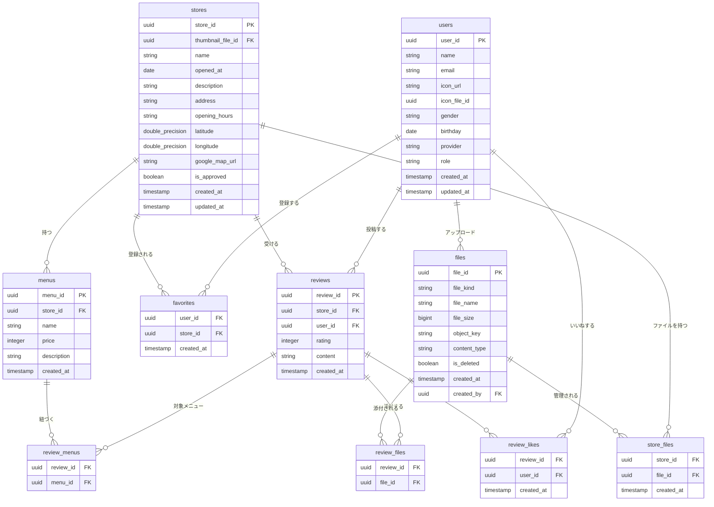
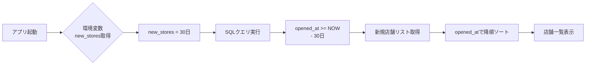

# DBとE-R図

---

## 1. ドキュメント情報

- **作成者:** 佐野
- **編集者:**
- **ステータス:** draft
- **最終更新日:** 2026/01/02
- **メモ:** DB設計を変更した場合、SQLも変更すること。中間テーブル（review_menus / review_files / store_files / review_likes）はORMモデルにも含める。

---

## 2. DB設計

### users（ユーザー情報）

| カラム名     | 型             | 説明                       |
| :----------- | :------------- | :------------------------- |
| user_id      | UUID（主キー） | Supabase Auth と連携       |
| name         | string         | ユーザー名                 |
| gender       | string         | 性別                       |
| birthday     | date           | 生年月日                   |
| email        | string         | メールアドレス（unique）   |
| icon_url     | string         | 外部プロフィール画像URL    |
| icon_file_id | uuid           | アプリ内アップロード画像ID |
| provider     | string         | 認証プロバイダ             |
| role         | string         | 権限（user/owner/admin）   |
| created_at   | time.Time      | 作成日時                   |
| updated_at   | time.Time      | 更新日時                   |

---

### stores（店舗情報）

| カラム名          | 型               | 説明                        |
| :---------------- | :--------------- | :-------------------------- |
| store_id          | uuid（主キー）   | 店舗ID                      |
| thumbnail_file_id | uuid             | サムネイル画像（files参照） |
| name              | string           | 店舗名                      |
| opened_at         | date             | オープン日                  |
| description       | string           | 店舗の説明文                |
| address           | string           | 住所                        |
| opening_hours     | string           | 営業時間（JSON形式も可）    |
| latitude          | double precision | 緯度                        |
| longitude         | double precision | 経度                        |
| google_map_url    | string           | Google Maps URL             |
| is_approved       | boolean          | 承認済みかどうか            |
| created_at        | timestamp        | 作成日時                    |
| updated_at        | time.Time        | 更新日時                    |

---

### favorites（お気に入り）

| カラム名                        | 型                                 | 説明           |
| :------------------------------ | :--------------------------------- | :------------- |
| user_id                         | uuid（外部キー → users.user_id）   | ユーザーID     |
| store_id                        | uuid（外部キー → stores.store_id） | 店舗ID         |
| created_at                      | timestamp                          | 登録日時       |
| PRIMARY KEY (user_id, store_id) | 制約                               | 重複登録を防ぐ |

---

### menus（メニュー）

| カラム名    | 型                                 | 説明       |
| :---------- | :--------------------------------- | :--------- |
| menu_id     | uuid（主キー）                     | メニューID |
| store_id    | uuid（外部キー → stores.store_id） | 店舗ID     |
| name        | string                             | メニュー名 |
| price       | integer                            | 価格       |
| description | string                             | 説明文     |
| created_at  | timestamp                          | 作成日時   |

---

### reviews（レビュー）

| カラム名   | 型                                 | 説明         |
| :--------- | :--------------------------------- | :----------- |
| review_id  | uuid（主キー）                     | レビューID   |
| store_id   | uuid（外部キー → stores.store_id） | 店舗ID       |
| user_id    | uuid（外部キー → users.user_id）   | ユーザーID   |
| rating     | integer（1?5）                     | 評価         |
| content    | string                             | レビュー内容 |
| created_at | timestamp                          | 作成日時     |

---

### review_menus（レビューとメニューの中間）

| カラム名    | 型                                   | 説明                           |
| :---------- | :----------------------------------- | :----------------------------- |
| review_id   | uuid（外部キー → reviews.review_id） | レビューID                     |
| menu_id     | uuid（外部キー → menus.menu_id）     | 紐づくメニューID               |
| PRIMARY KEY | (review_id, menu_id)                 | 同一メニューの重複紐付けを防ぐ |

---

### review_files（レビューとファイルの中間）

| カラム名    | 型                                   | 説明                           |
| :---------- | :----------------------------------- | :----------------------------- |
| review_id   | uuid（外部キー → reviews.review_id） | レビューID                     |
| file_id     | uuid（外部キー → files.file_id）     | 添付ファイルID                 |
| PRIMARY KEY | (review_id, file_id)                 | 同一ファイルの重複紐付けを防ぐ |

---

### review_likes（レビューいいね）

| カラム名    | 型                                   | 説明             |
| :---------- | :----------------------------------- | :--------------- |
| review_id   | uuid（外部キー → reviews.review_id） | レビューID       |
| user_id     | uuid（外部キー → users.user_id）     | ユーザーID       |
| created_at  | timestamp                            | いいね日時       |
| PRIMARY KEY | (review_id, user_id)                 | 重複いいねを防ぐ |

---

### store_files（店舗とファイルの中間）

| カラム名    | 型                                 | 説明                           |
| :---------- | :--------------------------------- | :----------------------------- |
| store_id    | uuid（外部キー → stores.store_id） | 店舗ID                         |
| file_id     | uuid（外部キー → files.file_id）   | 店舗に紐づくファイルID         |
| created_at  | timestamp                          | 紐付け日時                     |
| PRIMARY KEY | (store_id, file_id)                | 同一ファイルの重複紐付けを防ぐ |

---

### files（ファイル）

| カラム名     | 型                               | 説明                              |
| :----------- | :------------------------------- | :-------------------------------- |
| file_id      | uuid（主キー）                   | ファイルID                        |
| file_kind    | string                           | 種別（例：thumbnail, reviewなど） |
| file_name    | string                           | 元ファイル名                      |
| file_size    | bigint                           | ファイルサイズ                    |
| object_key   | string                           | Storage上のオブジェクトキー       |
| content_type | string                           | MIMEタイプ                        |
| is_deleted   | boolean                          | 論理削除フラグ                    |
| created_at   | timestamp                        | 作成日時                          |
| created_by   | uuid（外部キー → users.user_id） | 作成ユーザーID                    |

---

## 4. E-R図



---

## 5. ミーティング後の追加

### 店舗タブ切り替え用のDB設計

#### 要件

- アプリの店舗一覧を既存の `opened_at` で切り替えできるようにする。
- 現在の日付から `opened_at` を引いた値を `new_stores` に代入。
- 判定基準となる期間（日数）は **環境変数または設定テーブルで管理** し、将来的に変更可能とする。

---

#### 実装方針

- `new_stores` を利用し、クエリで条件抽出を行う。
- 判定期間（日数）はパラメータで設定する。
  - 例：`new_stores = 30`（環境変数または「新規店舗を1か月」とする場合）
  - または `configurations` テーブルに管理キーとして保存する。

---

#### サンプルクエリ（環境変数を利用する場合）



```sql
-- new_stores = 30 の場合
SELECT * FROM stores
WHERE opened_at >= NOW() - (INTERVAL '1 day' * 30)
ORDER BY opened_at DESC;
```
