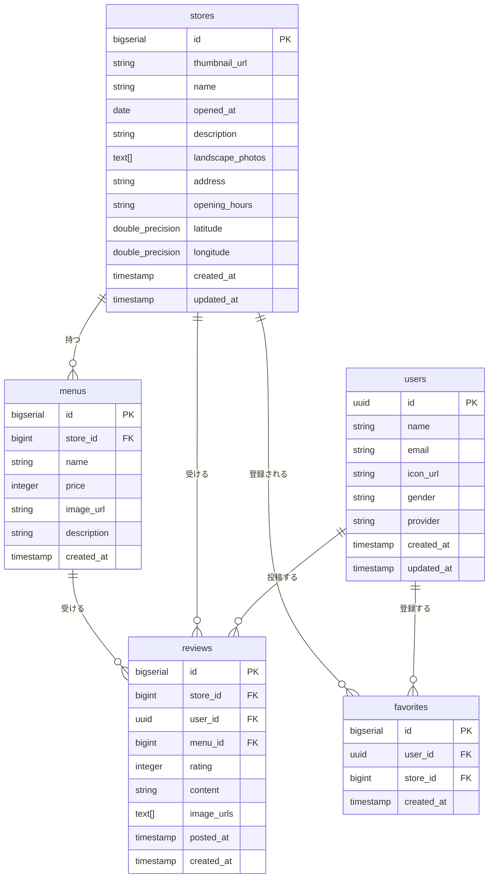
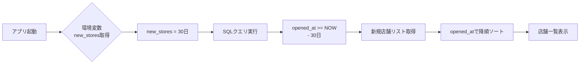

# DBとE-R図

---

## 1. ドキュメント情報

- **作成者:** 佐野
- **編集者:**
- **ステータス:** draft
- **最終更新日:** 2025/10/08
- **メモ:** DB設計を変更した場合、SQLも変更すること

---

## 2. DB設計

### users（ユーザー情報）

| カラム名   | 型                   | 説明                           |
| :--------- | :------------------- | :----------------------------- |
| id         | UUID（32桁, 主キー） | Supabase Auth と連携           |
| name       | string               | ユーザー名                     |
| email      | string               | メールアドレス（validate付き） |
| icon_url   | string               | デフォルト null                |
| gender     | string               | 性別                           |
| provider   | string               | 認証プロバイダ                 |
| created_at | time.Time            | 作成日時                       |
| updated_at | time.Time            | 更新日時                       |

---

### stores（店舗情報）

| カラム名         | 型                  | 説明                               |
| :--------------- | :------------------ | :--------------------------------- |
| id               | bigserial（主キー） | 店舗ID                             |
| thumbnail_url    | string              | サムネイル写真                     |
| name             | string              | 店舗名                             |
| opened_at        | date                | オープン日                         |
| description      | string              | 店舗の説明文                       |
| landscape_photos | text[]              | 店舗風景写真の配列（複数枚を想定） |
| address          | string              | 住所                               |
| opening_hours    | string              | 営業時間（JSON形式も可）           |
| latitude         | double precision    | 緯度                               |
| longitude        | double precision    | 経度                               |
| created_at       | timestamp           | 作成日時                           |
| update_at        | time.Time           | 更新日時                           |

---

### favorites（お気に入り）

| カラム名                  | 型                             | 説明           |
| :------------------------ | :----------------------------- | :------------- |
| id                        | bigserial（主キー）            | お気に入りID   |
| user_id                   | uuid（外部キー → users.id）    | ユーザーID     |
| store_id                  | bigint（外部キー → stores.id） | 店舗ID         |
| created_at                | timestamp                      | 登録日時       |
| unique(user_id, store_id) | 制約                           | 重複登録を防ぐ |

---

### menus（メニュー）

| カラム名    | 型                             | 説明         |
| :---------- | :----------------------------- | :----------- |
| id          | bigserial（主キー）            | メニューID   |
| store_id    | bigint（外部キー → stores.id） | 店舗ID       |
| name        | string                         | メニュー名   |
| price       | integer                        | 価格         |
| image_url   | string                         | メニュー写真 |
| description | string                         | 説明文       |
| created_at  | timestamp                      | 作成日時     |

---

### reviews（レビュー）

| カラム名   | 型                             | 説明               |
| :--------- | :----------------------------- | :----------------- |
| id         | bigserial（主キー）            | レビューID         |
| store_id   | bigint（外部キー → stores.id） | 店舗ID             |
| user_id    | uuid（外部キー → users.id）    | ユーザーID         |
| menu_id    | bigint（外部キー → menus.id）  | メニューID         |
| rating     | integer（1〜5）                | 評価               |
| content    | string                         | レビュー内容       |
| image_urls | text[]（NULL可）               | 写真（複数枚想定） |
| posted_at  | timestamp                      | 投稿日時           |
| created_at | timestamp                      | 作成日時           |

---

## 4. E-R図



---

## 5. ミーティング後の追加

### 店舗タブ切り替え用のDB設計

#### 要件

- アプリの店舗一覧を既存の `opened_at` で切り替えできるようにする。
- 現在の日付から `opened_at` を引いた値を `new_stores` に代入。
- 判定基準となる期間（日数）は **環境変数または設定テーブルで管理** し、将来的に変更可能とする。

---

#### 実装方針

- `new_stores` を利用し、クエリで条件抽出を行う。
- 判定期間（日数）はパラメータで設定する。
  - 例：`new_stores = 30`（環境変数または「新規店舗を1か月」とする場合）
  - または `configurations` テーブルに管理キーとして保存する。

---

#### サンプルクエリ（環境変数を利用する場合）



```sql
-- new_stores = 30 の場合
SELECT * FROM stores
WHERE opened_at >= NOW() - (INTERVAL '1 day' * 30)
ORDER BY opened_at DESC;
```
