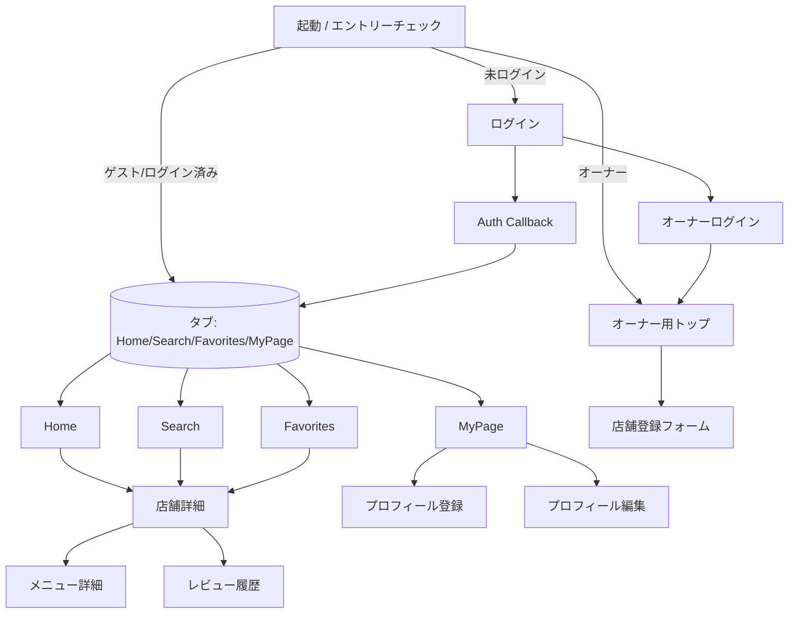

# 画面遷移図

## ドキュメント情報

| 項目     | 内容                          |
| -------- | ----------------------------- |
| 対象     | モバイルアプリ（Expo Router） |
| 最終更新 | 2025-02-17                    |

## 入口と遷移サマリー

- **未ログイン**: `/login` → `/auth/callback` を経由し `/(tabs)` へ遷移。
- **ゲスト/ログイン済みユーザー**: 直接 `/(tabs)`（Home/Search/Favorites/MyPage）。
- **オーナー判定済み**: `/owner/login` または `/owner` ダッシュボードへ。
- **共通**: 店舗詳細からメニュー詳細・レビュー履歴、MyPage からプロフィール登録/編集へ分岐。

## 画面構成と遷移

## 主要画面の役割・概要

| 画面 / パス                                                  | 役割・概要                                                                                                                      |
| ------------------------------------------------------------ | ------------------------------------------------------------------------------------------------------------------------------- |
| 起動/エントリーチェック (`/`)                                | Supabase セッションとゲストフラグを確認し、`/(tabs)`・`/owner`・`/login` へ振り分け。                                           |
| ログイン (`/login`, `/auth/callback`)                        | Supabase OAuth（Google/Apple）でサインイン。開発フラグでゲストログインを表示し、完了後に `/(tabs)` へ遷移。                     |
| ロール設定                                                   | 初回ログイン時に「ユーザー」か「店舗オーナー」を選択して以降の導線を確定。                                                      |
| オーナーログイン (`/owner/login`)                            | メール + パスワードでログインするフォーム（UI）。成功後はオーナーダッシュボードへ。                                             |
| Home タブ                                                    | おすすめ/新着/近い順で並び替え、タグ/カテゴリで絞り込み。カードから店舗詳細へ遷移。                                             |
| Search タブ                                                  | キーワード・カテゴリ・タグ・訪問済みフィルタを組み合わせて検索。検索履歴やソート種別を保持。                                    |
| Favorites タブ                                               | ローカル状態のブックマーク一覧。店舗詳細との双方向同期。                                                                        |
| MyPage タブ                                                  | プロフィール確認/編集、ログアウト、レビュー履歴への導線。未登録ならプロフィール登録へ強制リダイレクト。                         |
| プロフィール登録/編集 (`/profile/register`, `/profile/edit`) | 名前/メール/興味ジャンルなどをローカル保存し、MyPage 表示内容を更新。                                                           |
| 店舗詳細 (`/shop/[id]`)                                      | 画像スライダー、メニュータブ、タグ、地図リンク（Place ID ベース）、共有・お気に入りボタン。                                     |
| メニュー詳細 (`/menu?id=`)                                   | 店舗ごとのメニューをタブ切り替えで表示。                                                                                        |
| レビュー履歴 (`/review-history`)                             | ダミーデータの投稿履歴を一覧し、「お気に入り」「レビュー履歴」「いいね」をタブ切り替え。                                        |
| レビュー投稿                                                 | 評価・コメント・写真（複数）を投稿可能。メニュー選択は任意で、画像とメニューの紐づけは行わない。                                |
| オーナー用画面 (`/owner/*`)                                  | オーナーダッシュボードと店舗登録/編集フォーム（UI）。申請後は管理者承認で公開。自店舗の一覧・管理やオーナー専用詳細画面へ遷移。 |

## 補足

- すべての店舗・メニュー情報は現状 `@team/shop-core` のダミーデータを参照しています。API 連携時は同一フィールドを返すように揃えます。
- 認証状態は Supabase とローカル Context のハイブリッドで管理しています。未認証時は `/login` へリダイレクトします。

---
