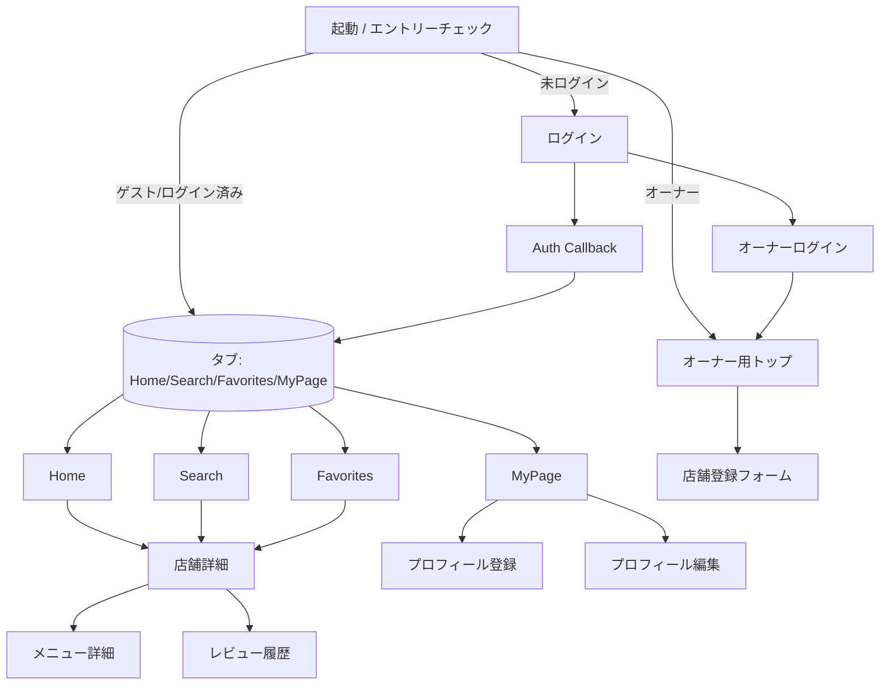

# 画面遷移図

## ドキュメント情報

- 対象: モバイルアプリ（Expo Router）
- 最終更新: 2025-02-17

## 画面構成と遷移

## 主要画面の役割

- **起動/エントリーチェック (`/`)**: Supabase セッションとゲストフラグを確認し、`/(tabs)`・`/owner`・`/login` へ振り分け。
- **ログイン (`/login`, `/auth/callback`)**: Supabase OAuth（Google/Apple）でサインイン。開発フラグでゲストログインを表示。
- **オーナーログイン (`/owner/login`)**: メール + パスワードでログインするフォーム（UI）。
- **Home タブ**: おすすめ/新着/近い順で並び替え、タグ/カテゴリで絞り込み。カードから店舗詳細へ遷移。
- **Search タブ**: キーワード・カテゴリ・タグ・訪問済みフィルタを組み合わせて検索。検索履歴やソート種別を保持。
- **Favorites タブ**: ローカル状態のブックマーク一覧。店舗詳細との双方向同期。
- **MyPage タブ**: プロフィール確認/編集、ログアウト、レビュー履歴への導線。未登録ならプロフィール登録へ強制リダイレクト。
- **店舗詳細 (`/shop/[id]`)**: 画像スライダー、メニュータブ、タグ、地図リンク（Place ID ベース）、共有・お気に入りボタン。
- **メニュー詳細 (`/menu?id=`)**: 店舗ごとのメニューをタブ切り替えで表示。
- **レビュー履歴 (`/review-history`)**: ダミーデータで投稿履歴を一覧。
- **プロフィール登録/編集 (`/profile/register`, `/profile/edit`)**: 名前/メール/興味ジャンルなどをローカル保存。
- **オーナー用画面 (`/owner/*`)**: オーナーダッシュボードと店舗登録フォーム（UI のみ、承認フローはバックエンドで実装）。

## 補足

- すべての店舗・メニュー情報は現状 `@team/shop-core` のダミーデータを参照しています。API 連携時は同一フィールドを返すように揃えます。
- 認証状態は Supabase とローカル Context のハイブリッドで管理しています。未認証時は `/login` へリダイレクトします。
