# 画面遷移図（Screen Flow）

このドキュメントは、アプリケーション全体の主要画面と遷移関係を示したものです。  
対象: React Native / Supabase を使用したモバイルアプリ（新規店舗向けレビューアプリ）  

---

## 目的

ユーザー・店舗オーナー・管理者の主要な操作を整理し、画面間の遷移を明確化する。  
ワイヤーフレームや Figma の設計と併せて参照する。

---

## 画面遷移図

```mermaid
flowchart TD

    A[ログイン] --> B[ロール設定]
    B --> C[ホーム]

    C --> D[マイページ]
    C --> E[店舗詳細]
    C --> F[店舗登録（オーナー向け）]

    D --> G[お気に入り一覧]
    G --> D

    E --> H[レビュー投稿]
    E --> I[店舗編集（オーナー向け）]

    F --> J[登録承認（管理者向け）]
    J --> E

    F --> E
    I --> E
```

---

## 画面説明

| 画面名 | 概要 |
|--------|------|
| **ログイン** | Supabase 認証（Email / Google OAuth）を使用してログインする画面。 |
| **ロール設定** | 初回ログイン時に「ユーザー」か「店舗オーナー」を選択。 |
| **ホーム** | 店舗一覧・マップ表示。絞り込みやソートが可能。 |
| **マイページ** | プロフィール編集・お気に入り・投稿履歴などを表示。 |
| **お気に入り一覧** | ユーザーがブックマークした店舗の一覧。 |
| **店舗詳細** | 店舗の基本情報・写真・レビュー・SNSリンクを表示。 |
| **レビュー投稿** | メニュー別レビューを投稿できる画面（画像添付あり）。 |
| **店舗登録（オーナー向け）** | 新規店舗情報を登録するフォーム。 |
| **店舗編集（オーナー向け）** | 既存店舗情報の修正画面。 |
| **登録承認（管理者向け）** | 店舗登録された内容を管理者が確認・承認する画面（オーナーの申請→管理者承認後に公開）。 |

---

_Last updated: 2025-10-06_
